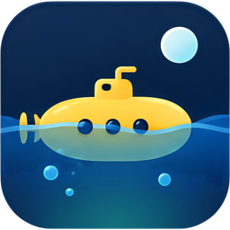

<p align="center">🇬🇧 <a href="README.md">English</a> | 🇮🇹 <strong>Italiano</strong></p>

<p align="center">
  
</p>

<h1 align="center">Submarine</h1>

<p align="center">
  <strong>Client VPN WireGuard multipiattaforma per Linux, Windows e macOS.</strong>
</p>

<p align="center">
  <a href="#avvio-rapido">Avvio rapido</a> &middot;
  <a href="#cli">CLI</a> &middot;
  <a href="#windows">Windows</a> &middot;
  <a href="#macos">macOS</a> &middot;
  <a href="#linux">Linux</a> &middot;
  <a href="#sviluppo">Sviluppo</a> &middot;
  <a href="#struttura-del-progetto">Struttura</a>
</p>

<p align="center">
  
  
  
  
  
  
  
  <br>
  
  
  
  
</p>

---

Submarine è un client VPN WireGuard con motore userspace in Rust
([boringtun](https://github.com/cloudflare/boringtun)), un servizio di sistema privilegiato che
gestisce tunnel e rete, un'app desktop Tauri + React e una CLI interattiva da terminale.

```sh
submarine connect ufficio      # nome del tunnel, anche parziale
submarine status --json
submarine killswitch on
```

## Perché Submarine?

- **Un motore, tre sistemi.** Lo stesso servizio Rust su Linux, Windows e macOS, con
  integrazione nativa di rotte, DNS e firewall su ciascuno.
- **Kill switch.** Il traffico fuori dal tunnel viene bloccato con nftables, WFP o `pf`.
- **Split tunnel per app.** Solo le app scelte passano dalla VPN, oppure tutte tranne quelle
  (Linux e Windows).
- **Cambi di rete seguiti.** Passando da Wi-Fi a cavo il traffico cifrato si sposta sulla nuova
  interfaccia senza far cadere il tunnel.
- **Riconnessione automatica.** Un tunnel che si interrompe, o il cui server non risponde agli
  handshake per 30 secondi, viene ricollegato con attese crescenti (da 1 s fino a 1 min),
  risolvendo di nuovo il nome del server. Con il kill switch il traffico resta bloccato nel
  frattempo.
- **App desktop e CLI.** Un'app Tauri con icona nella tray e un prompt Ink con completamento,
  cronologia e comandi da script.
- **Pausa.** Disconnette per 5 minuti, 15 minuti o un'ora, kill switch compreso, poi si
  riconnette da sola; dalla finestra, dal menu della tray o con `submarine pause 15`.
- **Traffico in tempo reale.** Velocità di ricezione e invio, un grafico dell'ultimo minuto e
  la durata della sessione nell'app; velocità, sparkline e durata nella riga di stato della CLI.
- **Configurazione standard.** File `.conf` wg-quick, importati così come sono.

## Avvio rapido

### 1. Build

```sh
cargo build                                   # servizio, librerie e strumento di sviluppo
cd apps/desktop && npm install && npm run tauri build   # app desktop
cd apps/cli && npm install && npx bun run build         # CLI in un unico eseguibile
```

Installer e build per piattaforma sono descritti in [Windows](#windows) e [macOS](#macos).

### 2. Avvio del servizio

```sh
sudo groupadd -f submarine && sudo usermod -aG submarine "$USER"   # poi rifai il login
sudo ./target/debug/submarine-daemon
```

### 3. Import di un tunnel e connessione

```sh
submarine import ./ufficio.conf ufficio   # oppure /import nel prompt interattivo
submarine connect ufficio
```

## CLI

`submarine` senza argomenti apre un prompt interattivo: comandi con `/` (`/connect`,
`/status`, `/pause`, `/killswitch`, `/log`, `/split`, `/apps`, ...), menu di completamento (Tab,
frecce, Esc), cronologia, la connessione seguita passo per passo e lo stato sempre visibile.
L'oceano animato nell'intestazione segue lo stato del servizio. Con `NO_COLOR` o fuori da un
terminale niente animazioni; in un terminale stretto o basso resta una riga d'onda.

Con un comando esegue ed esce, per gli script:

```sh
submarine connect ufficio          # nome del tunnel, anche parziale
submarine status --json
submarine killswitch on            # modifica solo quel campo delle impostazioni
submarine pause 15                 # 15 minuti senza VPN, poi si riconnette (o `resume`)
submarine apps add "C:\Program Files\Mozilla Firefox\firefox.exe"
```

Codici di uscita: `0` ok, `1` errore, `2` uso errato, `3` servizio non raggiungibile.

| Operazione | Comando (in `apps/cli`) |
| --- | --- |
| Avvio dai sorgenti | `npm install && npx bun run start` |
| Demo contro un servizio finto, senza toccare la rete | `npx bun run demo` |
| Test | `npx bun test` |
| Eseguibile unico | `npx bun run build` (`build:windows`, `build:macos`) |

L'installer Windows installa la CLI e la aggiunge al `PATH`.

## Windows

Build da Linux/WSL, in Docker (cross-compile MSVC con `cargo-xwin`):

```sh
scripts/build-windows.sh                                   # risultato in dist/windows/
scripts/build-windows.sh --copy-to /mnt/c/Users/<tu>/Downloads/submarine
scripts/windows/cargo.sh clippy -p submarine-daemon -- -D warnings   # solo controlli
```

Produce `Submarine_<versione>_x64-setup.exe`, che installa l'app, `submarine-daemon.exe` e
`wintun.dll` in `Program Files\Submarine` e registra il servizio **Submarine** (avvio
automatico, account LocalSystem, riavvio in caso di crash). La disinstallazione rimuove il
servizio e le regole del kill switch.

Senza installer, da un terminale **come amministratore**, con `wintun.dll` accanto
all'eseguibile:

```powershell
.\submarine-daemon.exe                  # in primo piano, log sulla console
.\submarine-daemon.exe service install  # oppure come servizio
.\submarine-cli.exe import Ufficio .\ufficio.conf
.\submarine-cli.exe connect <id>
.\submarine-daemon.exe reset-firewall   # rimuove le regole del kill switch
```

<details>
<summary><strong>Come funziona su Windows</strong></summary>

- Rotte con IP Helper (`0.0.0.0/1` + `128.0.0.0/1` per il traffico completo).
- Socket del tunnel legato all'interfaccia fisica (`IP_UNICAST_IF`), più una rotta host verso
  l'endpoint dal gateway attuale.
- DNS sull'interfaccia del tunnel con metrica minima; con un tunnel "tutto il traffico" le
  query DNS fuori dal tunnel vengono bloccate anche senza kill switch.
- Kill switch con filtri WFP persistenti.
- La named pipe è accessibile solo agli utenti connessi in modo interattivo; la cartella
  `ProgramData\Submarine` solo a SYSTEM e Administrators.
- Log del servizio in `ProgramData\Submarine\daemon.log`.
- Tunnel per app: driver kernel in `third_party/win-split-tunnel` (fork del driver di Mullvad),
  compilato e firmato in modalità test da GitHub Actions su un runner Windows ospitato. Se
  `dist/driver/submarine-split-tunnel.sys` esiste, `build-windows.sh` lo include
  nell'installer. In modalità "solo le app scelte" le app scelte non raggiungono la rete
  locale.

</details>

**Limiti attuali:** il driver è firmato solo per i test (per distribuirlo servono certificato
EV e attestation signing Microsoft); il cambio di rete è seguito solo per endpoint IPv4;
l'installer non è firmato (SmartScreen lo segnalerà).

## macOS

Da Linux si può solo fare il type-check (senza SDK Apple non si linka):

```sh
scripts/macos/check.sh clippy -p submarine-daemon -- -D warnings
```

Su un Mac (Xcode command line tools, Rust, Node.js):

```sh
scripts/macos/build.sh              # servizio, CLI e app (.app/.dmg)
sudo packaging/macos/install.sh     # servizio launchd it.mensys.submarine.daemon
sudo packaging/macos/uninstall.sh   # rimozione, incluse le regole del kill switch
```

<details>
<summary><strong>Come funziona su macOS</strong></summary>

- Interfaccia `utun`, rotte con `route` (`/1` più una rotta host verso l'endpoint dal gateway
  fisico, aggiornata se cambia rete).
- DNS con `networksetup` su tutti i servizi di rete, con backup ripristinato anche dopo un
  crash o un riavvio.
- Kill switch con un anchor `pf` (`com.apple/submarine`) che consente il traffico cifrato per
  indirizzo e porta dell'endpoint.
- Il socket del servizio è accessibile al gruppo `staff`, cioè agli utenti locali.
- Log in `/var/log/submarine-daemon.log`.

</details>

**Limiti attuali:** niente tunnel per app (serve una Network Extension); app e servizio non
firmati né notarizzati; installazione manuale del servizio.

## Linux

Requisiti del servizio:

- `nft` (pacchetto `nftables`) per kill switch e split tunnel;
- kernel con `CONFIG_CGROUP_NET_CLASSID` per lo split tunnel per app (cgroup `net_cls`);
- `resolvectl` se il sistema usa systemd-resolved (altrimenti viene gestito `/etc/resolv.conf`).

**Limiti noti dello split tunnel:** le app sono riconosciute dal percorso dell'eseguibile con
una scansione di `/proc` ogni 500 ms, quindi i primissimi pacchetti di un'app appena avviata
possono seguire la strada predefinita. App Flatpak/Snap e launcher script non sono supportati.
In modalità "solo le app scelte" le app incluse usano il DNS di sistema.

## Sviluppo

```sh
cargo test                  # unit test (esclude l'app desktop)
cargo clippy --all-targets -- -D warnings
./tests/docker/e2e.sh       # test end-to-end in container privilegiati
```

UI nel browser con servizio simulato (`?mock=empty`, `?mock=offline` per gli altri stati):

```sh
cd apps/desktop && npm install && npm run dev   # http://localhost:5173
```

App desktop reale. Su Linux servono le librerie di sistema di Tauri:

```sh
sudo apt install libwebkit2gtk-4.1-dev libayatana-appindicator3-dev librsvg2-dev libxdo-dev
# in un terminale: il servizio (root), con socket accessibile al gruppo submarine
sudo ./target/debug/submarine-daemon
# in un altro: l'app
cd apps/desktop && npm run tauri dev
```

Le regole per contribuire (commit, stile dei commenti, controlli prima del commit) sono in
[`AGENTS.md`](AGENTS.md).

## Struttura del progetto

| Percorso | Contenuto |
| --- | --- |
| `crates/submarine-config` | Parser/serializer dei file `.conf` (formato wg-quick) |
| `crates/submarine-tunnel` | Tunnel WireGuard userspace: TUN + UDP + boringtun |
| `crates/submarine-net` | Integrazione OS: rotte, DNS, kill switch, split tunnel per app |
| `crates/submarine-ipc` | Protocollo JSON tra UI e servizio, client e trasporto |
| `crates/submarine-daemon` | Servizio privilegiato che gestisce tunnel e rete |
| `crates/submarine-cli` | Strumento di sviluppo per i test end-to-end (`up`, `import`, ...) |
| `apps/cli` | CLI `submarine` (TypeScript + Ink): prompt interattivo e comandi da script |
| `apps/desktop` | App desktop Tauri 2 + React |
| `third_party/win-split-tunnel` | Driver Windows per il tunnel per app (fork Mullvad, GPL/MPL) |
| `packaging/` | Unit systemd, plist launchd, script di installazione macOS |
| `scripts/` | Build Windows e type-check macOS da Linux (Docker) |

## Licenza

[GPL-3.0-or-later](LICENSE). `third_party/win-split-tunnel` ha doppia licenza GPL-3.0 /
MPL-2.0 come il suo upstream.

---

<p align="center">Sviluppato con ❤️ da <a href="https://www.mensys.it/it/">Mensys</a></p>
